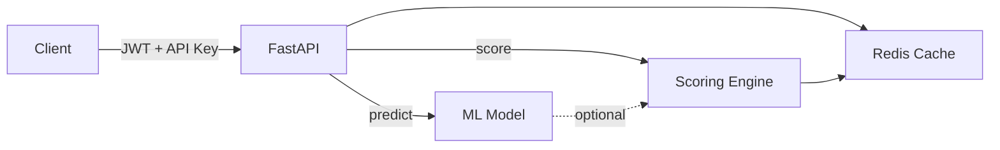

# Scoring API

**FastAPI microservice for real estate investment scoring — rule-based + ML predictions**

Production-ready REST API that scores investment properties using a multi-factor rule engine and optional RandomForest predictions. Containerized with Docker, cached with Redis, authenticated with JWT.

---

## Architecture



| Component | Purpose |
|-----------|---------|
| **FastAPI** | Async REST API with auto-generated Swagger docs |
| **Scoring Engine** | 4-factor weighted scoring (discount, price, liquidity, size) |
| **ML Model** | Optional RandomForest classifier (loaded from pickle) |
| **Redis** | Response caching with configurable TTL |
| **JWT Auth** | Token-based authentication via API key exchange |
| **Docker** | Multi-stage build, compose with Redis |

---

## Endpoints

| Method | Path | Auth | Description |
|--------|------|------|-------------|
| `POST` | `/token` | API key | Exchange API key for JWT |
| `POST` | `/score` | JWT | Score a single property |
| `POST` | `/score/batch` | JWT | Score up to 1000 properties |
| `GET` | `/model/metrics` | — | ML model metrics |
| `GET` | `/health` | — | Health check (model + Redis status) |

### Interactive docs

Run the server and open `http://localhost:8000/docs` for Swagger UI.

---

## Quick start

### Local

```bash
pip install -r requirements.txt
uvicorn app.main:app --reload
```

### Docker

```bash
docker compose up --build
```

### Get a token

```bash
curl -X POST http://localhost:8000/token \
  -H "Content-Type: application/json" \
  -d '{"api_key": "demo-key-12345"}'
```

### Score a property

```bash
curl -X POST http://localhost:8000/score \
  -H "Authorization: Bearer <token>" \
  -H "Content-Type: application/json" \
  -d '{
    "precio_total": 180000,
    "metros": 75,
    "precio_m2": 2400,
    "precio_m2_barrio": 3000,
    "barrio": "carabanchel"
  }'
```

Response:

```json
{
  "score_total": 72.5,
  "score_descuento": 36.0,
  "score_precio": 25,
  "score_liquidez": 15,
  "score_tamano": 10,
  "decision": "COMPRAR",
  "rentabilidad_estimada": 25.0
}
```

---

## Tech stack

- **Framework**: FastAPI 0.115 + Uvicorn
- **Validation**: Pydantic v2
- **Auth**: JWT (python-jose) + API key exchange
- **Cache**: Redis 5.x
- **ML**: scikit-learn (lazy-loaded)
- **Container**: Docker multi-stage build
- **CI**: GitHub Actions (lint → test → docker build)
- **Linting**: Ruff

---

## Project structure

```
ScoringAPI/
├── app/
│   ├── main.py              # FastAPI app + startup
│   ├── config.py             # Settings (pydantic-settings)
│   ├── auth.py               # JWT creation + verification
│   ├── models.py             # Pydantic request/response models
│   ├── scoring.py            # Rule-based scoring engine
│   ├── ml.py                 # ML model loader + predictor
│   ├── cache.py              # Redis caching layer
│   ├── rate_limit.py         # In-memory rate limiter
│   └── routers/
│       ├── scoring.py        # POST /score, POST /score/batch
│       ├── model.py          # GET /model/metrics
│       └── health.py         # GET /health
├── tests/
│   ├── test_api.py           # Integration tests (auth, scoring, rate limit)
│   └── test_scoring.py       # Unit tests (scoring logic)
├── Dockerfile                # Multi-stage Python 3.12
├── docker-compose.yml        # API + Redis
├── .github/workflows/ci.yml  # Lint + Test + Docker build
└── requirements.txt
```

---

## Key design decisions

- **API key → JWT flow**: API keys are verified server-side, then a short-lived JWT is issued. This avoids passing API keys on every request and enables token expiry.
- **Scoring cache**: Identical property inputs return cached results (Redis, 5min TTL). Avoids recomputing the same scores across requests.
- **Lazy ML loading**: scikit-learn is imported only when `load_model()` is called, keeping FastAPI boot under 1 second.
- **Multi-stage Docker**: Build stage installs deps, runtime stage copies only what's needed. Final image is ~150MB.

---

## Tests

```bash
pytest tests/ -v
```

9 tests covering:
- Health check
- Token generation (valid + invalid)
- Single property scoring
- Batch scoring
- Model metrics
- Rate limiting
- Scoring logic (COMPRAR/NEGOCIAR/DESCARTAR decisions, score ranges)
